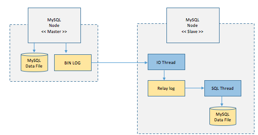
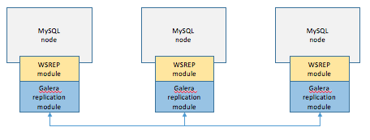

# 리플리케이션

리플리케이션은 DB를 권한에 따라 수직 구조(Master - Slave)로 구축하는 방식이다. 보통 Master Node는 쓰기 작업을 수행하며, Slave Node에서 읽기 작업을 수행시킨다. Master에서 발생한 로그를 통해 데이터를 비동기 방식으로 동기화한다.

이때 각각의 Master, Slave1, Slave2 ... 은 하나의 서버이다.

### 리플리케이션 처리방식



1. 마스터 노드에 쓰기 트랜잭션이 수행된다.
2. 쓰기 데이터를 저장하고 트랜잭션에 대한 로그 파일(BIN Log)을 기록한다.
3. 슬레이브 노드의 IO Thread는 마스터 노드의 로그 파일(BIN Log)을 파일(Replay Log)에 복사한다
4. 슬레이브 노드의 SQL Thread는 Replay Log 파일을 한 줄씩 읽으면서 반영한다.

위 과정은 데이터 무결성 검사를 수행하지 않는 비동기 방식으로 수행된다. 따라서 속도가 빠르다는 장점이 생기고 지연 시간이 적다. 하지만, 노드간의 데이터 동기화가 보장되지 않아 일관성 있는 데이터를 얻지 못할 수 있다. 또한 중간에 Master 노드가 다운되면 데이터 손실이 발생할 수 있다.

### MySQL에서 구성하기

**전체 정보**

```
**[Master 서버 DB, 계정정보]**
IP : 192.168.65.148(Master), 192.168.65.149(Slave)
DadaBases : repl_db
ID : user1
PW : test123

**[Replication 계정 정보]**
IP : 192.168.65.148 - (Master)
ID : repl_user
PW : test456
```

**Master DB 서버**

```sql
-- db 생성
create database repl_db default character set utf8; 
-- 계정 생성
mysql> create user user1@'%' identified by 'test123';
-- 권한 부여
grant all privileges on repl_db.* to user1@'%' identified by 'test123';
-- 리플리케이션 계정 생성
grant replication slave on *.* to 'repl_user'@'%' identified by 'test456';
```

my.cnf 설정

```sql
vi /etc/my.cnf
[mysqld]
log-bin=mysql-bin
server-id=1
```

MySQL 재시작 후 정보확인

```sql
show master status;
```

**Slave 서버**

```sql
-- DB 생성
create database repl_db default character set utf8;
-- 계정 생성
create user user1@'%' identified by 'test123';
-- 권한 부여
grant all privileges on repl_db.* to user1@'%' identified by 'test123';
```

my.cnf 설정

```
# vi /etc/my.cnf
[mysqld]
replicate-do-db='repl_db'
master-host=192.168.65.148
master-user=repl_user
master-password=test456
master-port=3306
server-id=2
```

서버 연결 설정

```sql
change master to
master_host='192.168.65.148',
master_user='repl_user',
master_password='test456',
master_log_file='mysql-bin.000010',
master_log_pos=1487;
```

# 클러스터링

클러스터링은 여러개의 DB를 수평적인 구조로 구축하는 방식이다. 클러스터링은 분산환경을 구성하여 Single point of failure 문제를 해결할 수 있는 Fail over 시스템을 구축하는 방식이다. 리플리케이션과 달리 동기 방식으로 처리하여 데이터 일치를 보장한다.

### 클러스터링 처리방식



1. 특정 노드에 트랜잭션이 수행되고 commit 된다
2. 실제 디스크에 내용을 쓰기 전에 다른 노드로 데이터 복제를 요청한다
3. 다른 노드에서 복제 요청을 수락했다는 신호를 보내고, 디스크에 쓰기를 시작한다
4. 모두 쓰기가 성공했다면 실제 디스크에 데이터를 저장한다
